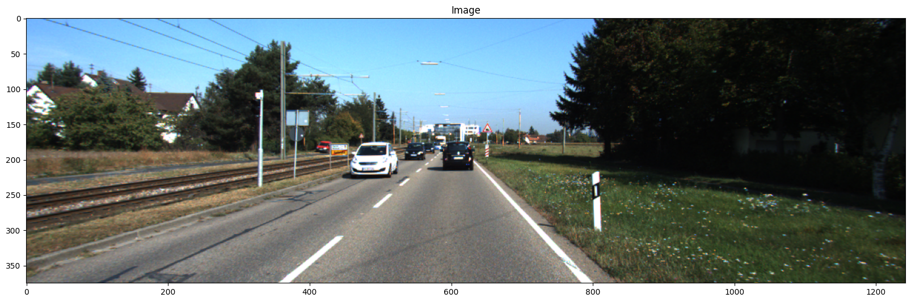
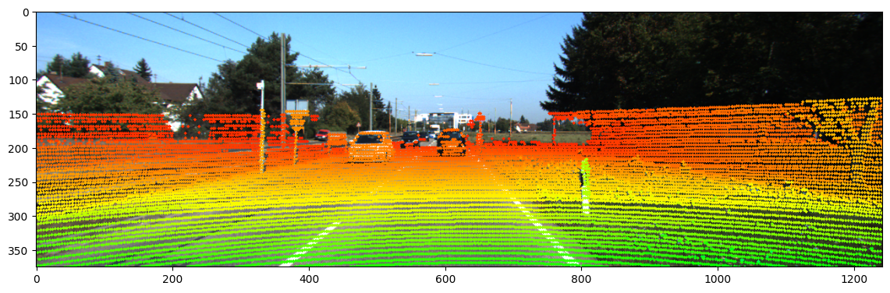

# LiDAR-to-Image Projection

## Overview
This project demonstrates how to project **3D LiDAR point cloud data** onto **2D RGB images** using camera calibration parameters. The code integrates point cloud data with corresponding camera images, allowing for **sensor fusion** between LiDAR and RGB cameras.

The implementation includes:
- Loading and visualizing **point cloud** (`.pcd`) and **image** (`.png`) data.
- Using **camera calibration matrices** to project 3D points onto a 2D plane.
- Overlaying projected LiDAR points onto images with depth-based coloring.
- Generating **video sequences** from the projected images.

## Features
✅ **LiDAR-Camera Fusion** – Aligns 3D point cloud data with 2D images.
✅ **Point Cloud Visualization** – Uses `pypotree` and `Open3D` for 3D visualization.
✅ **Projection with Calibration Data** – Uses intrinsic and extrinsic parameters for accurate mapping.
✅ **Video Processing** – Processes sequences of images and saves the output as a video.

## Installation
To run the notebook, install the required dependencies:
```bash
pip install open3d==0.16.0 pypotree numpy opencv-python matplotlib
```

## Dataset
The dataset is automatically downloaded from a predefined source. It includes:
- **Images**: RGB images (`.png` format)
- **LiDAR Scans**: Point cloud files (`.pcd` format)
- **Calibration Files**: Camera and LiDAR calibration (`.txt` format)

## Usage
### **1. Clone the Repository**
```bash
git clone https://github.com/rajatmehta1524/Lidar-to-Image-Projection.git
cd LiDAR-to-Image-Projection
```

### **2. Run the Jupyter Notebook**
```bash
jupyter notebook Point_Cloud_Projection_on_RGB_Image.ipynb
```

### **3. Visualize Data**
- View raw images and point clouds.
- Project LiDAR points onto images.
- Generate and save the overlaid video output.


## Code Breakdown
### **Step 1: Load and Visualize Data**
- Reads RGB images and point clouds.
- Displays them separately before projection.

### **Step 2: Apply Calibration and Projection**
- Reads calibration files.
- Converts 3D LiDAR points to 2D image space using matrix transformations.
- Colors points based on depth.

### **Step 3: Generate Video**
- Processes a sequence of images and point clouds.
- Saves the projected LiDAR-image overlay as a video file.

## Output Example


## Future Improvements
🚀 **Depth Estimation** – Enhance visualization with depth-based filtering.
📌 **Real-time Processing** – Implement real-time projection for live data.
🔍 **Object Detection Integration** – Combine with object recognition models.

## Contributing
Contributions are welcome! If you'd like to improve this project, feel free to **fork the repository**, create a new branch, and submit a pull request.

## License
This project is licensed under the MIT License - see the [LICENSE](LICENSE) file for details.

---
Made with ❤️ by [Rajat Mehta]

